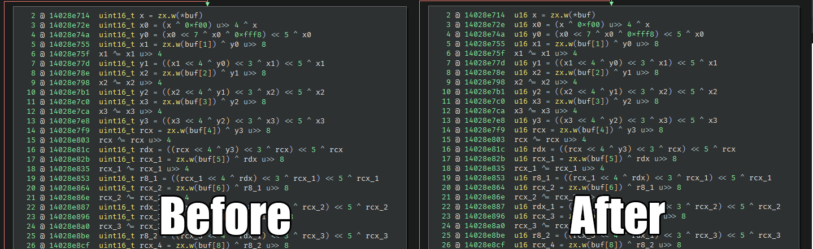
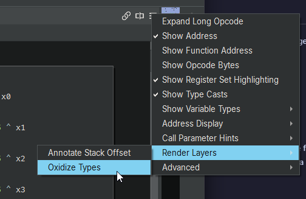

# CoolTypeOxidizer

This plugin uses the new [RenderLayer API](https://api.binary.ninja/binaryninja.renderlayer-module.html#binaryninja.renderlayer.RenderLayer) added in [5.0](https://binary.ninja/2025/04/23/5.0-gallifrey.html) to *visually* replace the sized C number types with their Rust equivalents in HLIL for easier readability.

Example: (`int64_t` => `i64`)

As this is a purely *visual* change, it costs us nothing and breaks nothing else.

## Before and After

## How to Use

Simply tick the `Oxidize Types` entry in the Render Layers section of the Burger Menu.

Note to the author of the [Type Oxidizer](https://github.com/austinzwile/TypeOxidizer) plugin:
I really want to try whatever you were smoking, it must have been **really** good.

## Known issues

### Overflow bar for function signature not covered by Render Layers
The function signature in the locked bar at the top of the BinaryView (that appears when the current function signature is not in view) can not be modified via the RenderLayer API at this time. ~~It will hopefully be added soon, at which point this plugin will be updated.~~

I have been informed that this is **not planned** and therefore, as far as I'm aware, there is nothing I can do about it at this time.
